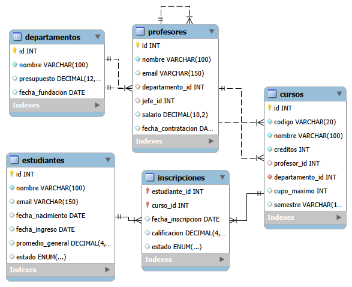

# sql-bootcamp-week04-university-system
Resolución de 15 consultas complejas en MySQL para la gestión de una universidad
# 📊 Práctica de SQL: Sistema de Gestión Universitaria

¡Bienvenido a mi repositorio de Análisis de Datos! En este proyecto, resolví una serie de 15 consultas complejas en MySQL para responder a preguntas de negocio y necesidades operativas de una institución educativa.

El objetivo principal fue demostrar el dominio de uniones de tablas (`JOINs`), funciones de agregación, agrupamientos avanzados (`GROUP BY` / `HAVING`) y lógica relacional.

## 🛠️ Estructura de la Base de Datos

Para este proyecto se utilizó una base de datos relacional orientada a la gestión académica, la cual cuenta con las siguientes entidades principales:
* **`departamentos`**: Registra las áreas de la universidad y sus presupuestos.
* **`profesores`**: Información de los docentes, sus salarios y departamentos.
* **`cursos`**: Las materias dictadas, sus códigos y profesores asignados.
* **`estudiantes`**: Datos demográficos y rendimiento general de los alumnos.
* **`inscripciones`**: Tabla intermedia que conecta a los estudiantes con sus cursos y realiza el seguimiento de sus estados (Inscrito, Aprobado, Retirado).

---

## 🗺️ Modelo Entidad-Relación (EER)

Aquí se puede observar cómo se conectan las tablas de la base de datos:



---

## 🚀 Mis Consultas Favoritas (Destacadas)

A continuación, presento tres de las consultas más interesantes que desarrollé en esta práctica, junto con el problema de negocio que resuelven:

### 1. Identificación de Profesores sin Carga Académica
* **Problema:** La dirección de la universidad necesitaba saber qué profesores no tienen cursos asignados este semestre para optimizar la distribución del personal.
* **Solución:** Utilicé un `INNER JOIN` estratégico combinado con un filtro `IS NULL` para aislar a los docentes que no tenían registros coincidentes en la tabla de cursos.

### 2. Estudiantes Multidisciplinarios (Dos o más departamentos)
* **Problema:** Detectar a los alumnos que están cursando materias en dos o más departamentos diferentes para incluirlos en un programa de mentoría integral.
* **Solución:** Conecté cuatro tablas y apliqué un COUNT(DISTINCT...) junto con la cláusula HAVING para filtrar los grupos después de la agregación.

### 3. Top 3 Cursos Más Populares (Excluyendo Retiros)
* **Problema:** Analizar cuáles son las tres materias con mayor cantidad de alumnos activos actualmente.
* **Solución:** Implementé un conteo agrupado excluyendo a los alumnos con estado 'retirado' mediante el operador <>, ordenando de forma descendente y limitando el resultado.

* **Habilidades Demostradas**
Modelado de datos y análisis de diagramas EER.
Filtrado avanzado con operadores relacionales (<>, IS NULL).
Uso de funciones de agregación (COUNT, DISTINCT).
Filtrado de datos agrupados mediante HAVING.
Optimización de reportes gerenciales uniendo múltiples tablas.


```sql
SELECT 
    p.nombre AS nombre_profesor, 
    d.nombre AS nombre_departamento
FROM profesores p
INNER JOIN departamentos d ON p.departamento_id = d.id
WHERE c.id IS NULL; 

SELECT
	e.nombre AS estudiante,
    COUNT(DISTINCT c.departamento_id) AS num_departamentos
FROM estudiantes e
INNER JOIN inscripciones i ON e.id = i.estudiante_id
INNER JOIN cursos c ON i.curso_id = c.id
GROUP BY e.id, e.nombre
HAVING COUNT(DISTINCT c.departamento_id) >= 2;

SELECT 
	c.codigo,
	c.nombre AS nombre_curso,
    COUNT(i.estudiante_id) AS total_inscriptos
FROM cursos c
INNER JOIN inscripciones i ON c.id = i.curso_id
WHERE i.estado <> 'retirado'
GROUP BY c.id, c.nombre, c.codigo
ORDER BY total_inscriptos DESC
LIMIT 3;
